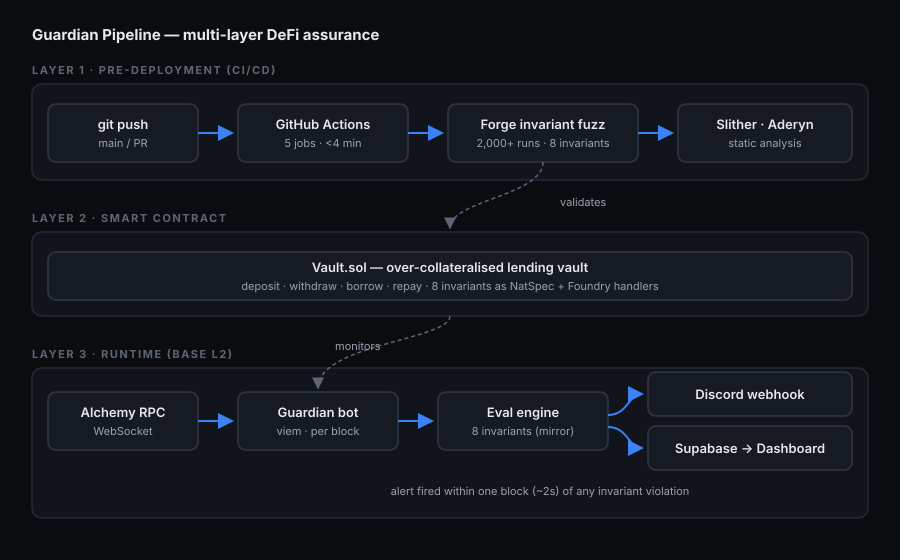

# Guardian Pipeline

[](https://github.com/rahilbhavan/guardian-pipeline/actions/workflows/invariant-ci.yml)
[](./docs/)
[](https://base.org)
[](https://soliditylang.org)

> An automated DeFi assurance pipeline that bridges the gap between
> pre-deployment invariant fuzz testing and live on-chain protocol monitoring.

**Demo video:** [Watch 3-min Loom ↗](YOUR_LOOM_URL)
**Live dashboard:** [guardian-pipeline.vercel.app ↗](YOUR_VERCEL_URL)

---

## Research motivation

This project is grounded in two empirical findings:

- **Bourveau et al. (2024)** — *Decentralized Finance (DeFi) assurance: early
  evidence* — analysed 8,500+ smart-contract audit reports and found that
  continuous, multi-layered assurance — not one-time audits — is the
  distinguishing characteristic of protocols that survive.

- **Landsman et al. (2025)** — *Auditing Smart Contracts* — found that
  traditional point-in-time static audits show little empirical evidence of
  preventing complex runtime exploits, including economic flash-loan attacks
  and dynamic balance manipulation.

**The gap:** no existing open-source tool unifies (a) pre-deployment invariant
fuzz testing in a CI pipeline with (b) live on-chain monitoring enforcing those
*same* invariants post-launch. Guardian Pipeline builds both layers, and proves
the property checked before deployment is byte-for-byte the property monitored
after it.

---

## Architecture



Three layers:

1. **CI/CD layer** — Foundry invariant fuzz tests run on every commit. A green
   badge means all 8 invariants held across 2,000+ randomised call sequences
   (300,000 calls) with zero reverts.
2. **Smart-contract layer** — a simple over-collateralised lending vault whose
   8 mathematical invariants are documented as NatSpec and exercised by Foundry
   handlers.
3. **Runtime guardian** — a TypeScript bot on Base L2. On each block it fetches
   vault state, evaluates the same 8 invariants, and fires a structured Discord
   alert within one block (~2 s) of any violation.

The off-chain evaluator (`guardian/src/evaluator.ts`) is a deliberate 1:1
mirror of the Solidity `invariant_*` functions in
`test/invariant/InvariantVault.t.sol`.

---

## The 8 invariants

| ID | Name | Formula | Severity |
|----|------|---------|----------|
| INV-01 | Solvency | `totalBorrowed ≤ totalDeposited` | Critical |
| INV-02 | Liquidity buffer | `tokenBalance(vault) ≥ totalDeposited − totalBorrowed` | Critical |
| INV-03 | Share price floor | `sharePrice ≥ 1e18` | High |
| INV-04 | Share accounting | `totalShares = Σ userShares[i]` | High |
| INV-05 | Collateral cap | `∀u: userBorrowed[u] ≤ userShares[u] × sharePrice / 1e18 × collateralRatio` | High |
| INV-06 | No share inflation | `sharePrice × totalShares / 1e18 ≤ totalDeposited` | Medium |
| INV-07 | Non-negative net | `totalDeposited ≥ totalBorrowed` | Medium |
| INV-08 | Zero-state consistency | `totalShares == 0 ⇔ totalDeposited == 0` | Low |

The Foundry harness asserts each one with `public view` invariant functions;
the Guardian bot evaluates each one in `evaluator.ts`. INV-04 and INV-05 use
aggregate proxies off-chain (the bot has no per-user event index in the MVP —
see the `TODO` comments in `evaluator.ts`).

---

## Foundry counterexample

To validate that the harness genuinely catches violations, temporarily break
`borrow()` so it forces `totalBorrowed = totalDeposited + 1`, then run the deep
profile. Forge shrinks the failure to a minimal call sequence:

```
[FAIL] invariant_solvency()
    Counterexample:
      calldata=deposit(0, 1000000000000000000)
               borrow(0, 1000000000000000001)
```

See [`docs/README.md`](docs/README.md) for the exact steps to reproduce and
screenshot this as `docs/counterexample.png`. This is the empirical validation
of the runtime-exploit gap that Landsman et al. (2025) describe.

---

## Test status

| Suite | Result |
|-------|--------|
| `InvariantVault` — 8 invariants, CI profile | ✅ 2,000 runs × 300,000 calls, 0 reverts |
| `VaultUnit` — 15 unit tests (happy paths, every revert, `attack()`) | ✅ all passing |
| `src/Vault.sol` line coverage | ✅ 100% (49/49) |

> The two `InsufficientLiquidity` guards in `Vault.sol` are provably
> unreachable given the 80% collateral cap — free liquidity always covers any
> single user's withdrawable/borrowable amount. They are retained as
> defence-in-depth and intentionally have no test.

---

## Quickstart

### Prerequisites

- [Foundry](https://getfoundry.sh/) installed
- Node.js ≥ 20
- Alchemy API key (free tier works)
- Discord webhook URL
- Supabase project (free tier works)

### 1. Clone and install

```bash
git clone https://github.com/rahilbhavan/guardian-pipeline
cd guardian-pipeline
forge install                       # forge-std + openzeppelin-contracts
cd guardian && npm install && cd ..
cd dashboard && npm install && cd ..
```

### 2. Run the invariant test suite

```bash
# Fast (default profile — 500 runs)
forge test --match-contract InvariantVault -vvv

# CI profile (2,000 runs)
FOUNDRY_PROFILE=ci forge test --match-contract InvariantVault -vvv

# Deep (10,000 runs — run before any release)
FOUNDRY_PROFILE=deep forge test --match-contract InvariantVault -vvv

# Unit suite + coverage
forge test --match-contract VaultUnit -vvv
forge coverage --report summary
```

### 3. Deploy to Base Sepolia

```bash
cp guardian/.env.example guardian/.env   # then fill in your keys

# One-time: import the testnet deploy key into an encrypted keystore.
# Foundry stores it password-protected — no raw private key on disk.
cast wallet import guardian-demo --interactive

export ATTACKER_ADDRESS=0xYourAttackerAddress
forge script script/DeployVault.s.sol \
  --account guardian-demo \
  --rpc-url $BASE_SEPOLIA_RPC --broadcast --verify
# Copy the deployed addresses into guardian/.env (VAULT_ADDRESS, TOKEN_ADDRESS)
```

### 4. Provision Supabase

Run the files in `supabase/migrations/` in order in the Supabase SQL editor (or
apply them with the Supabase CLI). `0001_init.sql` creates the `alerts` and
`blocks_checked` tables, enables row-level security with public read access, and
adds both tables to the real-time publication. `0002_lockdown_insert_rls.sql`
removes any public insert policy so writes require the service-role key.

Row-level security is **public read, no public write**: the dashboard reads with
the anon key, but inserts are denied to it — the Guardian bot must run with the
service-role key (`SUPABASE_SERVICE_KEY`), which bypasses RLS. This stops anyone
holding the public anon key from forging alerts.

### 5. Start the Guardian bot

```bash
cd guardian
npm run dev
```

### 6. Trigger the demo exploit (separate terminal)

```bash
cast send $VAULT_ADDRESS "attack()" \
  --account guardian-demo \
  --rpc-url $BASE_SEPOLIA_RPC
```

Guardian detects the violation on the next block, a Discord embed fires, and
the dashboard turns red — all within ~2 seconds.

### 7. Run the dashboard locally

```bash
cd dashboard
cp .env.example .env                 # fill in VITE_SUPABASE_* + VITE_VAULT_ADDRESS
npm run dev
```

---

## Repo structure

```
guardian-pipeline/
├── src/                  # Solidity contracts (Vault, MockERC20)
├── test/
│   ├── invariant/        # Foundry fuzz harness + handlers
│   └── unit/             # Deterministic unit coverage
├── script/               # Foundry deployment script
├── .github/workflows/    # CI/CD pipeline (5 jobs)
├── guardian/             # TypeScript Guardian bot (viem)
├── dashboard/            # React + Vite monitoring dashboard
├── supabase/migrations/  # Database schema
└── docs/                 # Architecture diagram, screenshots
```

---

## Tech stack

| Layer | Tools |
|-------|-------|
| Smart contracts | Solidity 0.8.24 · OpenZeppelin v5 · Foundry / Forge · Anvil · Cast |
| Static analysis | Slither · Aderyn |
| CI/CD | GitHub Actions (build · invariant-fuzz · coverage · static-analysis · gas-snapshot) |
| Guardian bot | TypeScript (strict) · viem · Alchemy WebSocket · pino |
| Alerts | Discord webhooks |
| Dashboard | React 18 · Vite · Supabase real-time |
| Deploy | Vercel (dashboard) · Base Sepolia (contracts) |

---

## CI/CD pipeline

`.github/workflows/invariant-ci.yml` runs five jobs on every push/PR to `main`:

1. **build** — `forge build --sizes`
2. **invariant-fuzz** — runs the harness at the `ci` profile; fails the job on
   any `[FAIL]` line.
3. **coverage** — generates an LCOV report and gates `src/Vault.sol` at ≥ 85%
   line coverage.
4. **static-analysis** — Slither + Aderyn, uploaded as artifacts.
5. **gas-snapshot** — `forge snapshot --check`; posts the diff as a PR comment.

A deliberate invariant violation causes `invariant-fuzz` to fail with
`::error::Invariant violation detected` in the Actions log.

---

## Licence

MIT
